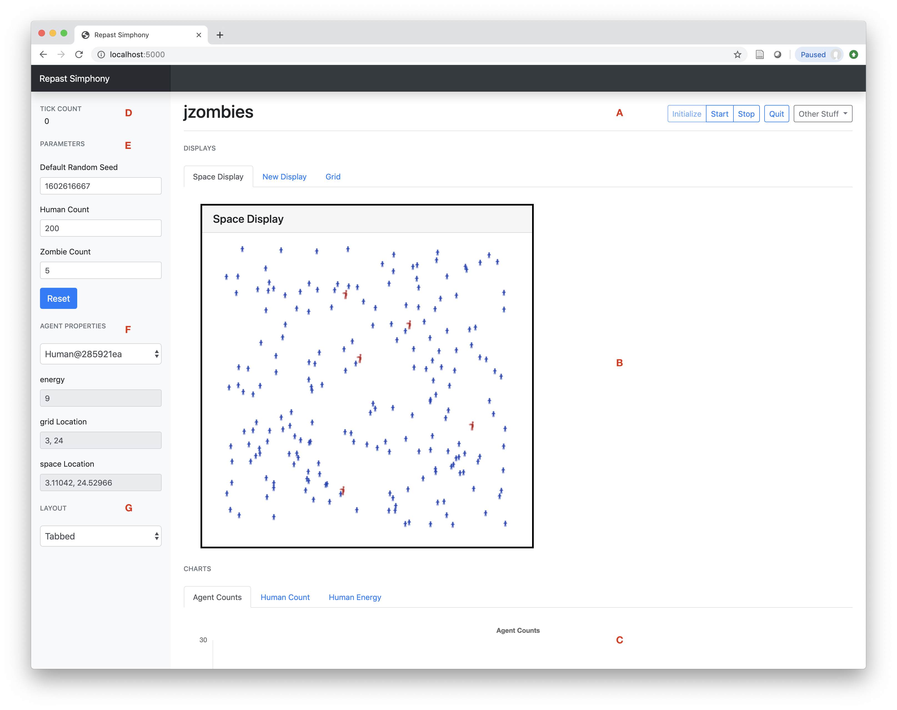
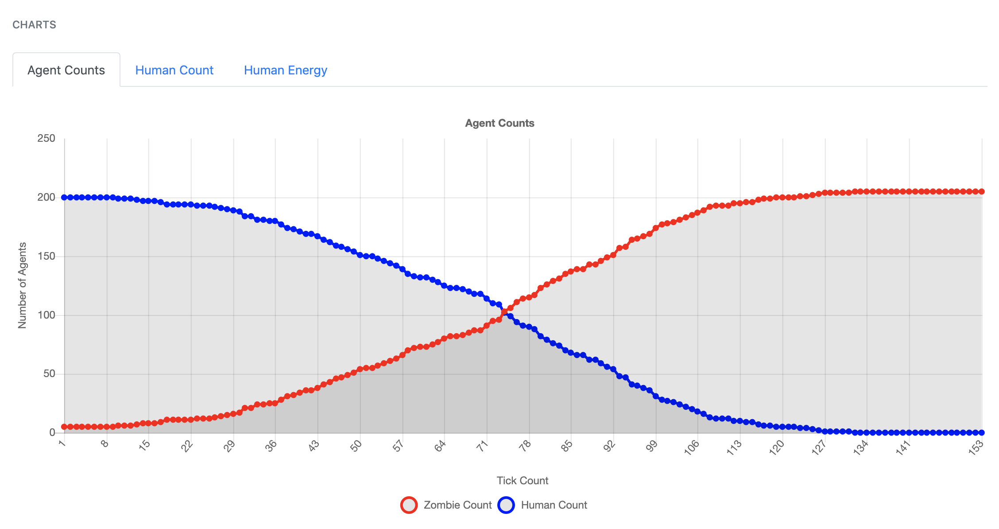
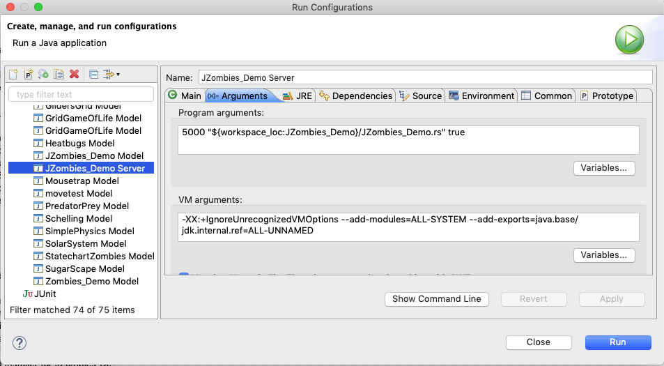

= Running your Repast Simphony Model via a Browser
June 2024
// NO SPACES BETWEEN LEADING TEXT AND : OPTIONS
:toc:
:icons:
:numbered:
:max-width: 55em
:website: http://repast.github.io

Repast Simphony version 2.7 and later has the ability to run your model using a web browser
as the user interface. The browser-based GUI has the following features:

* 2D grid, continuous space, and geography (GIS) visualization (currently restricted to edited styles only) 
* Tabbed and freeform visualization layout
* Time series plots
* Agent probing
* Model parameter setting
* Model runtime interaction (run, stop, pause, etc.)

The browser-based GUI is an alpha level feature in Repast Simphony 2.7, and while most, if
not all, models should load and run, the full array of existing GUI elements
is not yet supported. For example, controlling simulations through the User Panel
and visualizing ReLogo displays other than charts are both not yet supported.
In particular, the:

* `Geography`
* `JZombies`
* `GlidersGrid`
* `GridGameOfLife`

demonstration models provide the best examples of the newly implemented browser GUI.

NOTE: As of this writing, an https://github.com/mrdoob/three.js/issues/22582[issue] has been reported for an incompatibility 
between the three.js library and the Safari browser (version 15.0), causing the user interface to not load properly.
You can either use another browser or navigate to the `Developer` menu in Safari and enable `Experimental Features > WebGL via Metal`.

For feedback and questions about the browser GUI please contact us through our https://repast.github.io/support.html[regular support channels].

== Getting Started

. Launch the Repast Simphony Server
.. If your model was created using 2.7, then the launcher should already exist in your
model project's launchers folder (you may need to switch to the Repast Simphony perspective if the launchers folder is not visible). Right click on the launcher (e.g. `launchers/JZombies_Demo Server.launch`),
then `Run As`, and then the server entry.
.. If your model was created prior to 2.7, then the launcher needs to be added. Right click on your 
model's top level project folder, select the `Repast Simphony` menu entry, then `Add Server Launcher`.
Once the new launcher has been added, right click on it (e.g. `launchers/JZombies_Demo Server.launch`), then
`Run As`, and then the server entry (you may need to switch to the Repast Simphony perspective if the launchers folder is not visible).
. When the server starts, you should see the server output in your Eclipse console (e.g. <<img_console,Eclipse console>>), and your default browser
should be launched with the browser-based GUI displayed. If your default browser, is already
running then the browser-based GUI will open in a new tab. 
.. If a browser cannot be launched automatically, open your browser and go to `http://localhost:5000`.
. Click the `Initialize` button in the top right hand corner to initialize the model, after which the initial displays and 
plots should appear.
. Use the `Start`, `Step` and `Stop` buttons in the top right hand corner to start, step, and stop the model. You can repeatedly
run the same model, while changing the parameters etc., by restarting the model with `Initialize`, `Start`, or `Step`
after the model has stopped.
. Click `Quit` to stop the server and quit the model.

[[img_console]]
.Eclipse console with a successful server launch
image::images/console.png[]

The various parts of the GUI are described in greater detail below.

== The GUI

[[img_gui]]
.Repast Simphony Browser GUI

The GUI is divided into 7 parts, labeled A - G in the <<img_gui,browser GUI>>.

A. Toolbar. The `Initialize`, `Start`, `Step`, and `Stop` buttons will initialize, start, step and stop 
the model. `Quit` will stop the server and kill any running models. The server must be restarted
in order to run the model. `Other Stuff -> Kill Model,` will kill the model process, 
and can be used if the GUI becomes unresponsive.

B. Displays. The model visualizations will appear here. A display can be resized
by dragging the display's black border, and it can be moved by clicking and holding down the mouse 
on the header of the display (i.e. the darker section at the top of the display containing the
display's title). In Tabbed layout, clicking on a tab will show the named display.

C. Charts. Any time series charts will appear here. See <<img_charts,Chart tabs>> for an example.
Hover the mouse over a series (e.g. Zombie Count) to see the value at that point. Clicking
on a tab will display the named chart.

[[img_charts]]
.Repast Simphony Chart Tabs Example

[upperalpha]
[start=4]

. Tick count. The tick count is displayed here.

. Model parameters. Edit the model parameters here. The `Reset` button can
be used to return the parameters to their defaults as defined in the model's
`parameters.xml` file.

. Agent properties. Probed agent properties are displayed here. Click on an
agent's visual representation in one of the displays to to see that agent's 
properties. Select a previously probed agent using the drop down box.

. Display Layout. Select the display layout using the drop down box. Choices
are `Tabbed` and `Freeform`.
  - `Tabbed`. Show each display in a separate tab.
  - `Freeform`. Show all the displays on a shared canvas. 

== The Server

The server port (default 5000) and whether to auto-launch a browser when
the server is launched can be 
configured in the server's launch configuration (see, <<img_launcher,Launcher Configuration>>). 

1. Go to the `Run Menu` -> `Run Configurations` (at the bottom of the menu)
2. Click on the Server launcher you want to edit. 
3. Click on the Arguments tab
4. Edit the program arguments. The first argument (e.g. 5000) specifies the server
port, the second the scenario folder of the model to run, and the third argument
determines whether or not to auto-launch a browser where +true+ means auto-launch.

[[img_launcher]]
.Server Launcher Configuration Dialog

Note that if you change the server port, you will need update the port
number in the javascript code for the web sever itself. To do that,
you need to edit the `client.js` file in the repast.simphony.server plugin. On
macOS `client.js` can be found at:

`/Applications/Repast Simphony x.x.x/Eclipse.app/Contents/Eclipse/plugins/repast.simphony.server_x.x.x/web/static/js/client.js`

On Windows, `client.js` can be found at:

`C:\Users\<username>\RepastSimphony-x.x.x\eclipse\plugins\repast.simphony.server_x.x.x\web\static\js\client.js`

And on Linux, at:

`X/Eclipse/plugins/repast.simphony.server_x.x.x/web/static/js/client.js`

where `X` is the install location and `x.x.x` is the version number (e.g., 2.9.1). 

In `client.js` the port number is set on line 187:

`socket = new WebSocket('ws://localhost:5000/simphony/simsocket');`

Change `5000` to another port. For example, 

`socket = new WebSocket('ws://localhost:11219/simphony/simsocket');`
